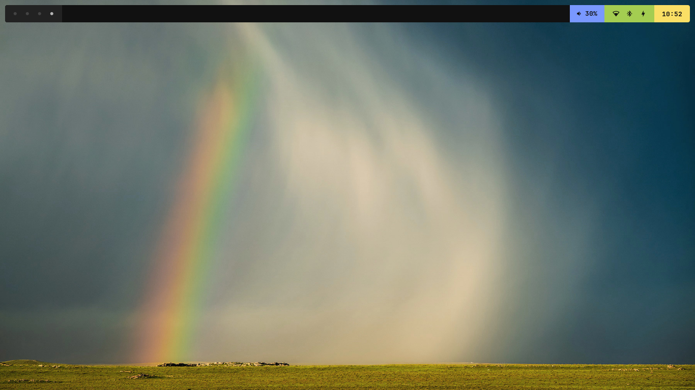
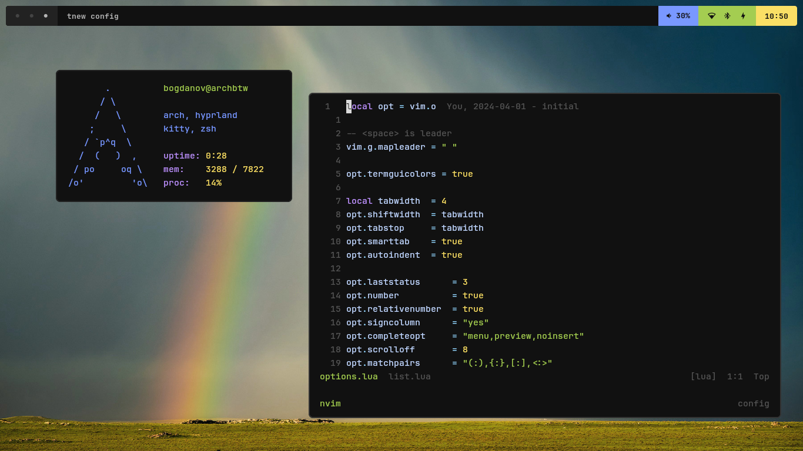
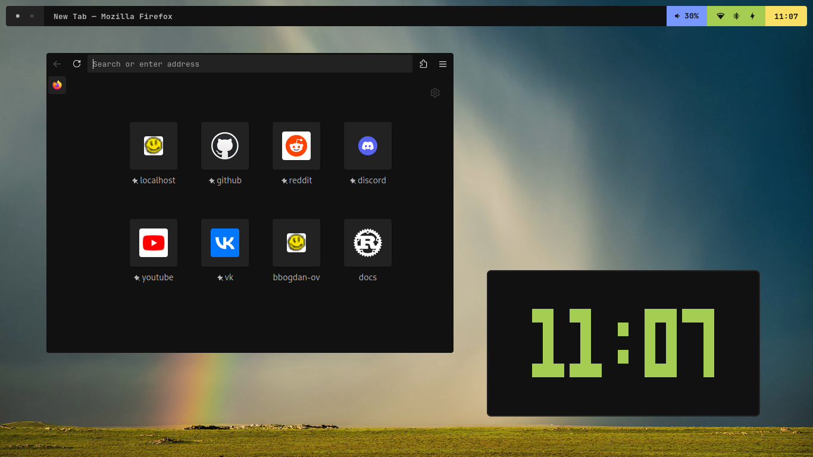

# bogdanov's dotfiles

this is a little collection of my config, script and other files

## Screenshots





## How to use

### Defining custom dotfiles path

**To define custom dotfiles path just put this line into your `~/.zshenv`:**
```bash
export DOTFILES=$MAYBE_VAR/path/to/dotfiles
```

### Syntax of link files

links `rc.zsh` *(relative to dir where link file is located)* to `~/.zshrc`:
```
rc.zsh = $HOME/.zshrc
```

links current dir to `~/.config/dir`:
```
. = $HOME/.config/dir
```

you can use your own env variables:
```
rc.zsh = $MY_VAR/.zshrc
```

also multiple lines are supported!
```
a.conf = $HOME/.a.conf
src/b.conf = $MY_ENV/.b.conf
```

**After you are done creating config files, run `linkall.sh` to link all files:**

```bash
./linkall
```

**Hooray!**

## MIT License

Do whatever you want with this DOTFILES

## P.S.

*this repository is dedicated to my lost dotfiles*

*inspired by architecture of [this dotfiles](https://github.com/andrew8088/dotfiles)*
